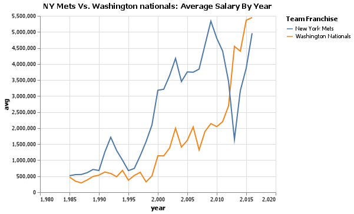

# Client Report - Finding Relationships in Baseball
__Course CSE 250__
__Joshua Sapp__

## Elevator pitch

We were asked to prove our capability to design and implement SQL Queries using a client database.  These are the requests were were asked to design, and a short analysis of each query's results. It should be noted that some of the columns returned from the desired queries are not very user friendly, such as playerid, which returns a jumble of letters and numbers.  If desired, we could easily adapt these columns to display more user friendly data such as the player's name, but for this report we have left them as the desired column values.

### GRAND QUESTION 1

#### Write an SQL query to create a new dataframe about baseball players who attended BYU-Idaho. The new table should contain five columns: playerID, schoolID, salary, and the yearID/teamID associated with each salary. Order the table by salary (highest to lowest) and print out the table in your report.

###### We found that there were a total of 30 entries that had players who attended BYU-idaho, however only two players were actually represented.  Their salaries range from \$215,000 to $4,000,000, and 7 teams are represented.  

### TECHNICAL DETAILS
#### Table 1-1: BYU-I Player information table
|    | playerid | schoolid | salary | teamid  | yearid |
|-:|:---------|:---------|:---------|:---------|:---------|
|0| lindsma01 | idbyuid | 4000000  |  CHA |   2014|
|1  | lindsma01 | idbyuid | 4000000  |  CHA  |  2014|
|2  | lindsma01 | idbyuid | 3600000 |   BAL  |  2012|
|3  | lindsma01 | idbyuid | 3600000 |   BAL  |  2012|
|4  | lindsma01 | idbyuid | 2800000 |   COL  |  2011|
|5  | lindsma01 | idbyuid | 2800000 |   COL  |  2011|
|6  | lindsma01 | idbyuid | 2300000  |  CHA  |  2013|
|7  | lindsma01 | idbyuid | 2300000 |   CHA  |  2013|
|8  | lindsma01 | idbyuid | 1625000  |  HOU  |  2010|
|9  | lindsma01 | idbyuid | 1625000  |  HOU  |  2010|
|10 | stephga01 | idbyuid | 1025000 |   SLN  |  2001|
|11 | stephga01 | idbyuid | 1025000 |   SLN  |  2001|
|12 | stephga01 | idbyuid | 900000 |   SLN  |  2002|
|13 | stephga01 | idbyuid | 900000 |   SLN  |  2002|
|14 | stephga01 | idbyuid |  800000 |   SLN |   2003|
|15 | stephga01 | idbyuid |  800000 |   SLN  |  2003|
|17 | stephga01 | idbyuid |  550000 |   SLN  |  2000|
|18 | lindsma01 | idbyuid |  410000 |   FLO  |  2009|
|19 | lindsma01 | idbyuid |  410000 |   FLO  |  2009|
|20 | lindsma01 | idbyuid |  395000 |   FLO  |  2008|
|21 | lindsma01 | idbyuid |  395000 |   FLO  |  2008|
|22 | lindsma01 | idbyuid |  380000 |   FLO  |  2007|
|23 | lindsma01 | idbyuid |  380000 |   FLO  |  2007|
|25 | stephga01 | idbyuid | 215000  |  SLN  |  1999|
|26 | stephga01 | idbyuid |  185000 |   PHI  |  1998|
|27 | stephga01 | idbyuid |  185000 |   PHI  |  1998|
|28 | stephga01 | idbyuid |  150000 |   PHI  |  1997|
|29 | stephga01 | idbyuid | 150000 | PHI | 1997 |

### GRAND QUESTION 2

#### This three-part question requires you to calculate batting average (number of hits divided by the number of at-bats)

#### 1. Write an SQL query that provides playerID, yearID, and batting average for players with at least one at bat. Sort the table from highest batting average to lowest, and show the top 5 results in your report.

##### Data Analysis: The top five players all had a 100% batting average due most likely to only having one at bat. 


#### 2. Use the same query as above, but only include players with more than 10 “at bats” that year. Print the top 5 results.

##### Data Analysis:  The top five players each had between a 54% - 64% batting average. 
#### Table 2-1: Per year batting averages for players with one or more "At Bats"
|    | playerid | yearid | batting_Average|
|---:|:---------|:---------|:---------|
|0 | abramge01|1923|1.0|
|1 |  aberal01|1957|1.0|
|2 | alanirj01|2019|1.0|
|3 | abernte02|1960 |1.0|
|4 | acklefr01|1964|1.0|
#### Table 2-2: Per year batting averages for players with ten or more "At Bats"
|    | playerid | yearid | batting_Average|
|---:|:---------|:---------|:---------|
|0|  nymanny01 |   1974  |       0.642857|
|1|  carsoma01 |   2013  |       0.636364|
|2|  silvech01 |   1948  |       0.571429|
|3|  puccige01 |   1930 |       0.562500|
|4|  applepe01 |   1927  |       0.545455|
#### Table 2-3: Career batting averages for players with 100 or more "At Bats"
|    | playerid | batting_Average|
|---:|:---------|:---------|
|0 | hazlebo01|0.402985|
|1 | jacksjo01|0.382456|
|2 | daviscu01|0.380952|
|3 | twombba01|0.377143|
|4 | fishesh01|0.374016|

#### 3. Now calculate the batting average for players over their entire careers (all years combined). Only include players with more than 100 at bats, and print the top 5 results.

##### Data Analysis: The top five players each had between a 37%-40% batting average.  
*See the "Technical details" section for the full table.

### GRAND QUESTION 3

#### Pick any two baseball teams and compare them using a metric of your choice (average salary, home runs, number of wins, etc.). Write an SQL query to get the data you need. Use Python if additional data wrangling is needed, then make a graph in Altair to visualize the comparison. Provide the visualization and its description.

##### Data Analysis: For this analysis we decided to compare the average player salary each year for the New York Mets against the same statistic for the Washington Nationals.  Salaries for both teams have grown from their initial average of around \$500,000 per player, though the average is far from consistent year by year. Historicity speaking, the New York Mets have had a higher average salary then the Washington Nationals, however between 2010 and 2015 they were overtaken by the Washington Nationals as the New York Mets made drastic cuts to their average player salary.  

#### Graph 3-1: NY Mets Vs. Washington Nationals: Average Salary by Year

## APPENDIX A (PYTHON SCRIPT)


```python
#%%
import pandas as pd
import datadotworld as dw
import altair as alt
from altair_saver import save

class Finding_Relationships_in_Baseball:

    def main(self):
        self.settup()
        self.q1()
        self.q2()
        self.q3()

    def settup(self):
        #do any needed initializing
        #alt.data_transformers.enable('json')
        pass

    def q1(self):
        """
        Write an SQL query to create a new dataframe about baseball players who attended BYU-Idaho. 
        The new table should contain five columns: playerID, schoolID, salary, and the yearID/teamID associated with each salary. 
        Order the table by salary (highest to lowest) and print out the table in your report.
        """

        request = dw.query('byuidss/cse-250-baseball-database', 
            "select sa.playerid, s.schoolid, sa.salary, sa.teamid, sa.yearid from salaries as sa join collegeplaying as c on sa.playerid = c.playerid join schools as s on c.schoolid = s.schoolid WHERE s.name_full = 'Brigham Young University-Idaho' order by sa.salary DESC")

        print(request.dataframe)

    def q2(self):
        """
        This three-part question requires you to calculate batting average (number of hits divided by the number of at-bats)

        a: Write an SQL query that provides playerID, yearID, and batting average for players with at least one at bat. Sort the table from 
            highest batting average to lowest, and show the top 5 results in your report.
        
        b: Use the same query as above, but only include players with more than 10 “at bats” that year. Print the top 5 results.

        c: Now calculate the batting average for players over their entire careers (all years combined). 
        Only include players with more than 100 at bats, and print the top 5 results.
        """
        request1 = dw.query('byuidss/cse-250-baseball-database', 
                    "SELECT p.playerid,b.yearid ,(b.h/b.ab) AS batting_Average FROM people AS p JOIN batting as b on p.playerid = b.playerid WHERE b.ab >= 1 ORDER BY batting_Average DESC LIMIT 5")        
        print(request1.dataframe)     

        request2 = dw.query('byuidss/cse-250-baseball-database', 
                    "SELECT p.playerid,b.yearid ,(b.h/b.ab) AS batting_Average FROM people AS p JOIN batting as b on p.playerid = b.playerid WHERE b.ab > 10 ORDER BY batting_Average DESC LIMIT 5")        
        print(request2.dataframe)          

        request3 = dw.query('byuidss/cse-250-baseball-database', 
                    "SELECT p.playerid,(b.h/b.ab) AS batting_Average FROM people AS p JOIN batting as b on p.playerid = b.playerid WHERE b.ab > 100 GROUP BY p.playerid ORDER BY batting_Average DESC LIMIT 5")        
        print(request3.dataframe)                    


    def q3(self):
        """
        Pick any two baseball teams and compare them using a metric of your choice (average salary, home runs, number of wins, etc.). 
        Write an SQL query to get the data you need. Use Python if additional data wrangling is needed, then make a graph in Altair to 
        visualize the comparison. Provide the visualization and its description.
        """
        request1 = dw.query('byuidss/cse-250-baseball-database',
                    "select tf.franchname, s.yearid as year, avg(s.salary) from salaries as s JOIN teams as t on s.teamid = t.teamid JOIN teamsfranchises as tf on t.franchid = tf.franchid WHERE tf.franchname = 'Washington Nationals' group by s.yearid")
        request2 = dw.query('byuidss/cse-250-baseball-database',
                    "select tf.franchname, s.yearid as year, avg(s.salary) from salaries as s JOIN teams as t on s.teamid = t.teamid JOIN teamsfranchises as tf on t.franchid = tf.franchid WHERE tf.franchname = 'New York Mets' group by s.yearid")
        
        chart1 = (alt.Chart(request1.dataframe,title= "NY Mets Vs. Washinton nationals: Average Salary By Year")
            .encode(
                x='year',
                y='avg',
                color =alt.Color('franchname',legend=alt.Legend(title="Team Franchise")))
            .mark_line()
            )

        chart2 = (alt.Chart(request2.dataframe)
            .encode(
                x='year',
                y='avg',
                color =alt.Color('franchname',legend=alt.Legend(title="Team Franchise")))
            .mark_line()
            )

        chart = chart1 + chart2
        filename = "q3 chart.png"
        save(chart,filename)

f = Finding_Relationships_in_Baseball()
f.main()


# %%

```

