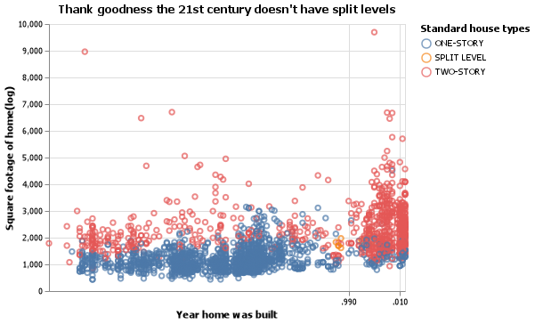

### CSE 250 Coding Challenge

__Joshua Sapp__

### Challenge Summary

I was able to fully complete problems 1, 3, and 4 with good effort on problems 2 and 5.  On problem 2 I was stumped on how to use a pd.Series to create an altair box chart, as I have never worked with either pd.Series or altair box charts before.  On problem 5 i simply ran out of time and decided to leave it where it was to focus on writing this final bit.

#### Challenge 1

##### Answer



##### Code

```python
 
class Problem_1:

    def __init__(self):
        url = 'https://github.com/byuidatascience/data4dwellings/raw/master/data-raw/dwellings_denver/dwellings_denver.csv'
        self.dat_home = pd.read_csv(url).sample(n=4500, random_state=15)

    def main(self):
        #print(self.dat_home.columns)
        self.refine_data()
        self.create_chart(self.dat_home)

    def refine_data(self):
        #print(self.dat_home['arcstyle'].unique())
        self.dat_home = self.dat_home.query("arcstyle == 'ONE-STORY' or arcstyle == 'TWO-STORY' or arcstyle == 'SPLIT LEVEL'")

    def create_chart(self,data):
        
        chart = alt.Chart(data).mark_point().encode(
            alt.X('yrbuilt:T',title='Year home was built'),
            alt.Y("livearea:Q",title="Square footage of home(log)"),
            alt.Color('arcstyle:N',title="Standard house types")
        )

        chart.title = "Thank goodness the 21st century doesn't have split levels"

        chart_name = "q1.png"
        save(chart,chart_name)

```

#### Challenge 2

##### Answer

**INCOMPLETE**

##### Code

```python
 
class Problem_2:

    def __init__(self):
        self.mister = pd.Series(["lost",15,22,45,31,"lost",85,38,129,80,21,2])

    def main(self):
        self.refine_data()
        self.create_chart(self.mister)

    def refine_data(self):
        self.mister = self.mister.replace('lost',125)
        data = self.mister.to_numpy()

    def create_chart(self,data):
        
        chart = alt.Chart(data).mark_boxplot(extent='min-max').encode(
            x='index',
            y='value'
        )

        chart_name = "q2.png"
        save(chart,chart_name)

```

#### Challenge 3

##### Answer

59.83

##### Code

```python
 
class Problem_3:

    def __init__(self):
        self.mister = pd.Series(["lost",15,22,45,31,"lost",85,38,129,80,21,2])

    def main(self):
        self.refine_data()
        self.find_mean()

    def refine_data(self):
        self.mister = self.mister.replace('lost',125)

    def find_mean(self):
        mean = self.mister.mean()
        print(round(mean,2))

```

#### Challenge 4

##### Answer

|    |   cases |
|---:|--------:|
|  0 |     745 |
|  1 |    2666 |
|  2 |   37737 |
|  3 |   80488 |
|  4 |  212258 |
|  5 |  213766 |

##### Code

```python
 
class Problem_4:

    def __init__(self):
        url = 'https://github.com/byuidatascience/data4python4ds/raw/master/data-raw/table1/table1.json'  
        self.data = pd.read_json(url)

    def main(self):
        self.refine_data()
        self.create_table()

    def refine_data(self):
        print(self.data.columns)
        self.data = self.data.drop(columns=['country','year','population'])

    def create_table(self):
        print(self.data.to_markdown())

```

#### Challenge 5

##### Answer

**INCOMPLETE**

##### Code

```python
 
class Problem_5:

    def __init__(self):
        url = "http://byuistats.github.io/CSE250-Course/data/clean_starwars.csv"
        self.dat = pd.read_csv(url)

    def main(self):
        self.classify()

    def split_data(self):
        data = train_test_split(self.dat,test_size = .20,random_state = 2020)
        self.test_data = data.drop(columns='gender')
        self.key = data.gender


    def classify(self):
        gbc = GradientBoostingClassifier()
        gbc.fit(self.test_data.self.key)

```
