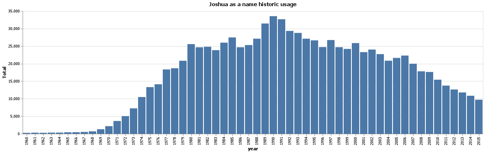
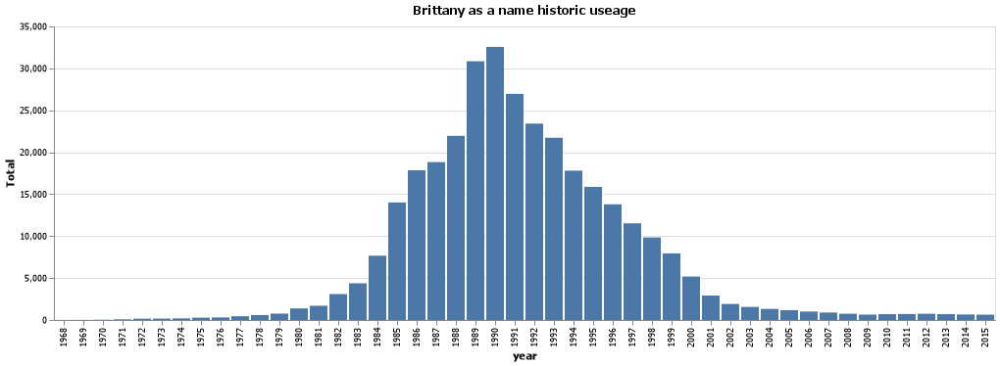
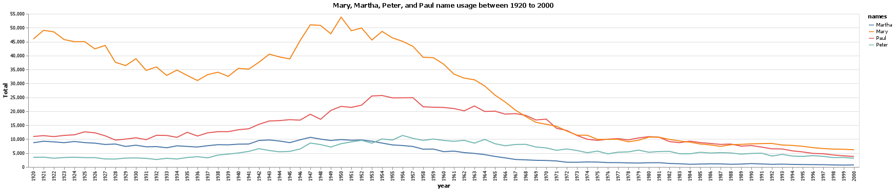
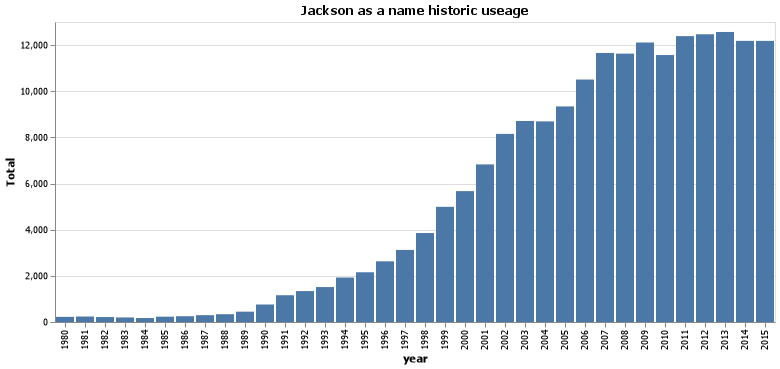

# Client Report - What is in a name
__Course CSE 250__
__Joshua Sapp__


## Elevator pitch

_We were asked to take a large historical name dataset and answer a few questions regarding that dataset.  After compiling the results, these were the results._

### GRAND QUESTION 1
#### How does your name at your birth year compare to its use historically?

My name, Joshua, caped in popularity in 1990.  Its been fairly consistant as a popular name choice starting in 1969, but has been falling off since 1990.



### GRAND QUESTION 2
#### If you talked to someone named Brittany on the phone, what is your guess of their age? What ages would you not guess?
A good guess would be that they were born in 1990 since that is when the name peaked in popularity, making them 31 as of 2021.  Id avoid guessing anytime before 1984 or after 2000 since those are times where the name was out popularity.



### GRAND QUESTION 3
#### Mary, Martha, Peter, and Paul are all Christian names. From 1920 - 2000, compare the name usage of each of the four names.
Historicly speeking, Mary is by far the most popular of the four names, with Paul pulling a fairly distant second for the bulk of the timeframe.  All four have been dropping off slowly in popularity however, with Martha almost falling off the chart completly.



### GRAND QUESTION 4
#### Think of a unique name from a famous movie. Plot that name and see how increases line up with the movie release.
I chose the name Jackson from the movie "Percy Jackson and the Lightning thief".  Interestingly, the name seemed to be building in popularity up untill 2010 when the film releaced, where there was a dip in popularity before it returned to normal.  I find this interesting, as the movie was pourly recieved, possibly influencing the name's popularity as well.




## APPENDIX A (PYTHON SCRIPT)

```python
import numpy as np
import pandas as pd
import altair as alt
from altair_saver import save

class What_is_in_a_name:

    def main(self):
        self.settup()
        self.q1()
        self.q2()
        self.q3()
        self.q4()

    def settup(self):
        #do any needed initilizing
        self.data = pd.read_csv("names_year.csv")
        #alt.data_transformers.enable('json')

    def q1(self):
        #How does your name at your birth year compare to its use historically?

        #Refines dataset to contain only relevant data
        q1_data = self.data.query("name == 'Joshua'& year <= 2015 & year >= 1960")

        #Generates Table using given data
        chart = (alt.Chart(q1_data,title = 'Joshua as a name historic usage')
            .encode(
                x= 'year:O',
                y='Total')
            .mark_bar()
            )


        save(chart, "q1.png")

    def q2(self):
        #If you talked to someone named Brittany on the phone, what is your guess of their age? What ages would you not guess?
        q2_data = self.data.query("name == 'Brittany'")
        chart = (alt.Chart(q2_data,title="Brittany as a name historic useage")
            .encode(
                x= 'year:O',
                y='Total')
            .mark_bar()
            )

        save(chart, "q2.png")

    def q3(self):
        #Mary, Martha, Peter, and Paul are all Christian names. From 1920 - 2000, compare the name usage of each of the four names.
        q3_data1 = self.data.query("name == 'Martha' & year <= 2000 & year >= 1920")
        q3_data2 = self.data.query("name == 'Peter' & year <= 2000 & year >= 1920")
        q3_data3 = self.data.query("name == 'Paul' & year <= 2000 & year >= 1920")
        q3_data4 = self.data.query("name == 'Mary' & year <= 2000 & year >= 1920")

        chart1 = (alt.Chart(q3_data1,title= "Mary, Martha, Peter, and Paul name usage between 1920 to 2000")
            .encode(
                alt.X('year:O'),
                y='Total',
                color =alt.Color('name',legend=alt.Legend(title="names")))
            .mark_line()
            )

        chart2 = (alt.Chart(q3_data2)
            .encode(
                alt.X('year:O'),
                y='Total',
                color =alt.Color('name',legend=alt.Legend(title="names")))
            .mark_line()
            )

        chart3 = (alt.Chart(q3_data3)
            .encode(
                alt.X('year:O'),
                y='Total',
                color =alt.Color('name',legend=alt.Legend(title="names")))
            .mark_line()
            )

        chart4 = (alt.Chart(q3_data4)
            .encode(
                alt.X('year:O'),
                y='Total',
                color =alt.Color('name',legend=alt.Legend(title="names")))
            .mark_line()
            )

        chart = chart1 + chart2 + chart3 + chart4

        filename = 'q3.png'
        save(chart, filename)

    def q4(self):
        #Think of a unique name from a famous movie. Plot that name and see how increases line up with the movie release.
        q4_data = self.data.query("name == 'Jackson' & year <= 2015 & year >= 1980")
        chart = (alt.Chart(q4_data,title="Jackson as a name historic useage")
            .encode(
                x= 'year:O',
                y='Total')
            .mark_bar()
            )

        save(chart, "q4.png")

w = What_is_in_a_name()
w.main()


