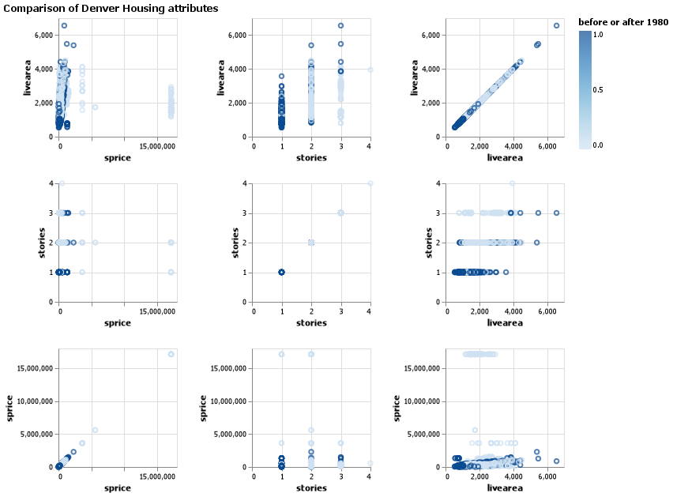

# Client Report - Can you Predict That
__Course CSE 250__
__Joshua Sapp__

## Elevator pitch

We were asked to build a classifier that used basic machine learning to predict weather a house was built before or after 1980 given some parameters such as the house's garage size, architecture style, and other metrics.  The result was a system that has around a 95% accuracy, depending on the evaluation metric. 

### GRAND QUESTION 1
#### Create 2-3 charts that evaluate potential relationships between the home variables and before1980.

We created a few tables shown below.  they compare each of the different metrics that we evaluated in our table, compared to one another.



##### TECHNICAL DETAILS

    ### Table Generation Code Segment 

    data = data.head(5000)

    chart = alt.Chart(data).mark_point().encode(
                alt.X(alt.repeat("column"), type='quantitative'),
                alt.Y(alt.repeat("row"), type='quantitative'),
                color=alt.Color('target', legend=alt.Legend(title="before or after 1980"))
            ).properties(
                width=150,
                height=150
            ).repeat(
                row=['livearea','stories','sprice',],
                column=['sprice','stories','livearea',],
            )

    chart.title = "Comparison of Denver Housing attributes"

    chart_name = "q1 bonus.png"
    save(chart,chart_name)

### GRAND QUESTION 2
#### Can you build a classification model (before or after 1980) that has at least 90% accuracy for the state of Colorado to use (explain your model choice and which models you tried)?
    Repete layout and content from GQ1 for GQ2 where applicable

### GRAND QUESTION 3
#### Will you justify your classification model by detailing the most important features in your model (a chart and a description are a must)?
We used a model called RandomForestClassifier.  Its a classifier algorithm that utilizes random variation to determine what metrics to compare at each step to build out its tree, so a diagram of any given run will not be representative of all runs.

### GRAND QUESTION 4
####  Can you describe the quality of your classification model using 2-3 evaluation metrics? You need to provide an interpretation of each evaluation metric when you provide the value.
The four evaluation metrics we used came out as folows:
Accuracy: 95.48% 
Recall: 93.15%   
Percision: 94.65%
F1 Score: 93.89% 
It is important to note that these metrics have slight variation to them each time they are run as the training and test data is randomly selected from the datasets, causing small variations.

#### Technical Details
```python
### formulas used to calculate each
accuracy = round(success/len(guesses)*100,2)
precision = round((true_positive/(true_positive+false_positive))*100,2)
recall = round((true_positive / (true_positive + false_negative))*100,2)
f1 = round((2*precision*recall)/(precision+recall),2)
```

## APPENDIX A (PYTHON SCRIPT)


```python
from sklearn import datasets
from sklearn.model_selection import train_test_split
from sklearn.ensemble import RandomForestClassifier
from sklearn.datasets import make_classification
import pandas as pd
import numpy as np
import os
import altair as alt
from altair_saver import save

HOME_DIRECTORY = os.getcwd()

def prepForOutput():
    #creates a folder to save graphs to in working directory
    if not os.path.exists(f'{HOME_DIRECTORY}/program outputs'):
        os.mkdir(f'{HOME_DIRECTORY}/program outputs')
    os.chdir(f'{HOME_DIRECTORY}/program outputs')

def classify():
    #Import data
    data = pd.read_csv("dwellings_denver.csv")

    #Define our target
    data.loc[data.yrbuilt > 1980, 'target'] = 0
    data.loc[data.yrbuilt <= 1980, 'target'] = 1

    #Drop columns containing unwanted data
    data = data.drop(columns="yrbuilt")
    data = data.drop(columns="parcel")
    data = data.drop(columns="abstrprd")
    data = data.drop(columns="qualified")
    data = data.drop(columns="status")
    data = data.drop(columns="deduct")
    data = data.drop(columns="netprice")
    data = data.drop(columns="tasp")
    data = data.drop(columns="xtraffic")
    data = data.drop(columns="floorlvl")

    #Adust non number values to numbers.  
    #Notably, this makes the data harder to read for a human but doesn't actually change the data's meaning.
    qualites = 0
    for value in data.quality.unique():
        data.loc[data.quality == value, 'quality'] = qualites
        qualites += 1
    conditions = 0
    for value in data.condition.unique():
        data.loc[data.condition == value, 'condition'] = conditions
        conditions += 1
    garage_types = 0
    for value in data.gartype.unique():
        data.loc[data.gartype == value, 'gartype'] = garage_types
        garage_types += 1
    styles = 0 
    for value in data.arcstyle.unique():
        data.loc[data.arcstyle == value, 'arcstyle'] = styles
        styles += 1

    #Seperate the data into our input data and our target data
    in_data = data.drop(columns="target")
    target_data = data.target

    #Convert pandas dataframes into numpy arrays
    x = in_data.to_numpy()
    y = target_data.to_numpy()

    #Initialize and implement the random forest classifier
    clf = RandomForestClassifier()
    X_train, X_test, Y_train, Y_test = train_test_split(x, y, test_size=0.2)
    clf.fit(X_train,Y_train)
    guesses = clf.predict(X_test)
    key = Y_test

    #Interpret results and identify accuracy with various metrics.
    index = 0
    success = 0
    true_positive = 0
    true_negative = 0
    false_positive = 0
    false_negative = 0
    for value in guesses:
        if value == key[index]:
            if value == 0:
                true_positive += 1
            if value == 1:
                true_negative += 1
            success += 1
        else:
            if value == 0:
                false_positive += 1
            if value == 1:
                false_negative += 1
        index += 1

    #Calculate accuracy metrics
    accuracy = round(success/len(guesses)*100,2)
    precision = round((true_positive/(true_positive+false_positive))*100,2)
    recall = round((true_positive / (true_positive + false_negative))*100,2)
    f1 = round((2*precision*recall)/(precision+recall),2)

    print(f"Accuracy: {accuracy}% ({success}/{len(guesses)})")
    print(f"Recall: {recall}%")
    print(f"Percision: {precision}%")
    print(f"F1 Score: {f1}%")

    # Generate Tables using data

    data = data.head(5000)

    chart = alt.Chart(data).mark_point().encode(
                alt.X(alt.repeat("column"), type='quantitative'),
                alt.Y(alt.repeat("row"), type='quantitative'),
                color=alt.Color('target', legend=alt.Legend(title="before or after 1980"))
            ).properties(
                width=150,
                height=150
            ).repeat(
                row=['livearea','stories','sprice',],
                column=['sprice','stories','livearea',],
            )

    chart.title = "Comparison of Denver Housing attributes"

    chart_name = "q1 bonus.png"
    save(chart,chart_name)

    


classify()
```