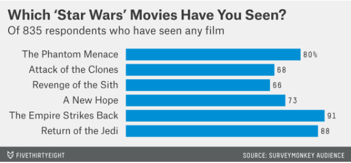
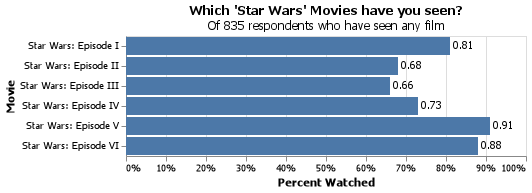
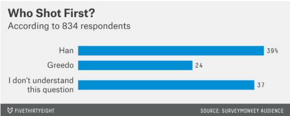
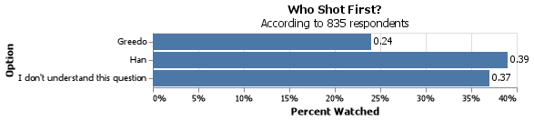

# Client Report - The war with Star Wars
__Course CSE 250__
__Joshua Sapp__

## Elevator pitch

We were asked to investigate the viability of using questions about a new hire candidate's Star Wars preferences to make an educated guess about their current income using data collected by FiveThirtyEight in 2014. We were able to accurately re-create models made by FiveThirtyEight, however the accuracy of the model for this use case is pour.  A correlation between an individual's income and their Star Wars preferences does exist, however it is a pour metric to measure by.  Our model averages around a 59% accuracy, with an F1 score of around 72% given 100 trial runs.  We would not recommend using this dataset for this use case, however some other useful information about the candidate, such as what age range or Census Region  the candidate belongs to.

### GRAND QUESTION 1
#### Shorten the column names and clean them up for easier use with pandas.
We cleaned up the column names.  The new names are as follows: 
```
Response -> seen_starwars
Response.1 -> fan
Star Wars: Episode I  The Phantom Menace -> seen_1
Star Wars: Episode II  Attack of the Clones -> seen_2
Star Wars: Episode III  Revenge of the Sith -> seen_3
Star Wars: Episode IV  A New Hope -> seen_4
Star Wars: Episode V The Empire Strikes Back -> seen_5
Star Wars: Episode VI Return of the Jedi -> seen_6
Star Wars: Episode I  The Phantom Menace.1 -> rating_1
Star Wars: Episode II  Attack of the Clones.1 -> rating_2
Star Wars: Episode III  Revenge of the Sith.1 -> rating_3
Star Wars: Episode IV  A New Hope.1 -> rating_4
Star Wars: Episode V The Empire Strikes Back.1 -> rating_5
Star Wars: Episode VI Return of the Jedi.1 -> rating_6
Han Solo -> Han_Solo_rating
Luke Skywalker -> Luke_Skywalker_rating
Princess Leia Organa -> Princess_Leia_Organa_rating
Anakin Skywalker -> Anakin_Skywalker_rating
Obi Wan Kenobi -> Obi_Wan_Kenobi_rating
Emperor Palpatine -> Emperor_Palpatine_rating
Darth Vader -> Darth_Vader_rating
Lando Calrissian -> Lando_Calrissian_rating
Boba Fett -> Boba_Fett_rating
C-3P0 -> C-3P0_rating
R2 D2 -> R2_D2_rating
Jar Jar Binks -> Jar_Jar_Binks_rating
Padme Amidala -> Padme_Amidala_rating
Yoda -> Yoda_rating
Response.2 -> shot_first
Response.3 -> keu
Response.4 -> feu
Response.5 -> fst
Response.6 -> gender
Response.7 -> age_range
Response.8 -> income
Response.9 -> education
Response.10 -> location
```

##### TECHNICAL DETAILS
we renamed the columns using a simple pandas script applied to our data frame.  The 'name_replacements' variable contained a dictionary that hand all the old and new names stored in it.
```
df.rename(columns=name_replacements,inplace=True)
```


### GRAND QUESTION 2
#### Filter the dataset to those that have seen at least one film.

This was actually a two step process, as it was possible for someone to have 'seen star wars' without having seen any of the films.  First we needed to drop all responses that claimed to have not seen star wars (entries where 'seen star wars' was false) then we needed to filter thrugh the rest of the data, checking each row to ensure that at least one of the 'seen 1' - 'seen 6' columns had a response in it.  


##### TECHNICAL DETAILS

Code to drop responces with "No" as the response in "seen_starwars"
```
df = df.drop(df[df.seen_starwars == "No"].index)
```
Code to drop rows without at least one "seen_x" column true
```
df = df.loc[~((df['seen_1'] != 'Star Wars: Episode I  The Phantom Menace') 
& (df['seen_2'] != 'Star Wars: Episode II  Attack of the Clones') 
& (df['seen_3'] != 'Star Wars: Episode III  Revenge of the Sith')  
& (df['seen_4'] != 'Star Wars: Episode IV  A New Hope') 
& (df['seen_5'] != 'Star Wars: Episode V The Empire Strikes Back') 
& (df['seen_6'] != 'Star Wars: Episode VI Return of the Jedi')),:]

```

### GRAND QUESTION 3
#### Please validate that the data provided on GitHub lines up with the article by recreating 2 of their visuals and calculating 2 summaries that they report in the article.

We recreated two of their charts, and found that while our formatting is slightly different then theirs, our actual results are the same.

##### Percent Watched charts
Their original chart

Our replica

##### Who shot first chart
Their original chart

Our replica


Additionally, we ran some calculations to see if we could match their provided statistics and came up with the following results.

##### Men vs Women fans
Original statistic: 72% of men who watched starwars considered themselves a fan vs 60% of women
Our statistic: 71.8% of men who watched starwars considered themselves a fan vs 59.95% of women.  
Results: These statistics are within a margin of error likely caused by rounding, so we consider them a match for the purposes of determining if this dataset is accurate.

##### TECHNICAL DETAILS
All code for this section used "chart_data" as its start-point.  "chart_data" is the main dataset refined to only include responses where the individual had seen at least one movie.

Code to create the "Watched percent" charts
```
chart_1_df = pd.DataFrame({'Movie': ['Star Wars: Episode I','Star Wars: Episode II','Star Wars: Episode III','Star Wars: Episode IV','Star Wars: Episode V','Star Wars: Episode VI'],
"Percent":[round(chart_data.seen_1.sum()/len(chart_data),2),round(chart_data.seen_2.sum()/len(chart_data),2),round(chart_data.seen_3.sum()/len(chart_data),2),round(chart_data.seen_4.sum()/len(chart_data),2),round(chart_data.seen_5.sum()/len(chart_data),2),round(chart_data.seen_6.sum()/len(chart_data),2)]})
chart = alt.Chart(chart_1_df,).mark_bar().encode(
    alt.X('Percent',title='Percent Watched',axis=alt.Axis(format='.0%')),
    y='Movie')
text = chart.mark_text(
    align='left',
    baseline='middle',
    dx=3  # Nudges text to right so it doesn't appear on top of the bar
    ).encode(
    alt.Text('Percent:Q')
    ).properties(
    title={
      "text": ["Which 'Star Wars' Movies have you seen?"], 
      "subtitle": [f"Of {len(chart_data)} respondents who have seen any film"],
    }
    )
chart += text
```
Code to create the "Who shot first" chart
```
counts =chart_data.shot_first.value_counts()
chart_2_df = pd.DataFrame({"Option": ["Han","Greedo","I don't understand this question"],
"Percent":[round(counts[2]/len(chart_data),2),round(counts[1]/len(chart_data),2),round(counts[0]/len(chart_data),2)]})
chart = alt.Chart(chart_2_df,).mark_bar().encode(
    alt.X('Percent',title='Percent Watched',axis=alt.Axis(format='.0%')),
    y='Option')
text = chart.mark_text(
    align='left',
    baseline='middle',
    dx=3  # Nudges text to right so it doesn't appear on top of the bar
    ).encode(
    alt.Text('Percent:Q')
    ).properties(
    title={
      "text": ["Who Shot First?"], 
      "subtitle": [f"According to {len(chart_data)} respondents"],
    }
    )
chart += text
save(chart,'chart 2.png')
```
Code to generate the Men vs Women statistics
```
md = chart_data.query("gender == 'Male'")
rmd = md.query("fan == 'Yes'")
print(f"Male fan percentage: {(round(len(rmd)/len(md),4))*100}%")
fd = chart_data.query("gender == 'Female'")
rfd = fd.query("fan == 'Yes'")
print(f"Female fan percentage: {(round(len(rfd)/len(fd),4))*100}%")
```

### GRAND QUESTION 4
#### Clean and format the data so that it can be used in a machine learning model.  Please achieve the following requests and provide examples of the table with a short description the changes made in your report.

#####  Create an additional column that converts the age ranges to a number and drop the age range categorical column.
Completed, the new column is called "age_range_group" and has been translated to the following values:
```
18-29: 0
30-44: 1
> 60: 2
45-60: 3
```
##### Create an additional column that converts the school groupings to a number and drop the school categorical column.
Completed, the new column is called "education_group" and has been translated to the following values:
```
High school degree: 0
Some college or Associate degree: 1
Bachelor degree: 2
Graduate degree: 3
```
##### Create an additional column that converts the income ranges to a number and drop the income range categorical column.
Completed, the new column is called "income_group" and has been translated to the following values:
```
nan: 0
$0 - $24,999: 1
$100,000 - $149,999: 2
$25,000 - $49,999: 3
$50,000 - $99,999: 4
$150,000+: 5
```
##### Create your target (also known as label) column based on the new income range column.
Completed, the new column is called "target" and has the following values:
```
>$50K: 1
<$50K: 0
```
##### One-hot encode all remaining categorical columns.
Completed.  All other categorical columns have been One-hot encoded to allow the classifier to understand the data.

##### TECHNICAL DETAILS
For all calculations, the output was saved to a data frame called "clean_data".  This data frame is the same as the "chart_data" data frame from above, but without the "respondent Id" column, as that information is irrelevant for the classifier and may throw off its calculations.

Code to translate the age range groups
```
qualites = 0
for value in clean_data.age_range.unique():
    print(f"{value}: {qualites}")
    clean_data.loc[clean_data.age_range == value, 'age_range_group'] = qualites
    qualites += 1
clean_data = clean_data.drop(columns="age_range")
```
Code to translate the education groups
```
qualites = 0
for value in clean_data.education.unique():
    print(f"{value}: {qualites}")
    clean_data.loc[clean_data.education == value, 'education_group'] = qualites
    qualites += 1
clean_data = clean_data.drop(columns="education")
```
Code to translate the income groups
```
qualites = 0
for value in clean_data.income.unique():
    print(f"{value}: {qualites}")
    clean_data.loc[clean_data.income == value, 'income_group'] = qualites
    qualites += 1
clean_data = clean_data.drop(columns="income")
```
Code that creates our target column
```
clean_data['target'] = 0
clean_data.loc[clean_data['income_group'] > 3, 'target'] = 1
```
Code that One-hot encodes all other columns and replaces NaN values with outliers that the classifier should ignore.
```
Remaining_columns = ['seen_starwars', 'fan', 'seen_1', 'seen_2', 'seen_3',
       'seen_4', 'seen_5', 'seen_6', 'rating_1', 'rating_2', 'rating_3',
       'rating_4', 'rating_5', 'rating_6', 'Han_Solo_rating',
       'Luke_Skywalker_rating', 'Princess_Leia_Organa_rating',
       'Anakin_Skywalker_rating', 'Obi_Wan_Kenobi_rating',
       'Emperor_Palpatine_rating', 'Darth_Vader_rating',
       'Lando_Calrissian_rating', 'Boba_Fett_rating', 'C-3P0_rating',
       'R2_D2_rating', 'Jar_Jar_Binks_rating', 'Padme_Amidala_rating',
       'Yoda_rating', 'shot_first', 'keu', 'feu', 'fst', 'gender', 'location']
for column in Remaining_columns:
    qualites = 0
    for value in clean_data[column].unique():
        print(f"{value}: {qualites}")
        clean_data.loc[clean_data[column] == value, f'{column}'] = qualites
        qualites += 1

clean_data = clean_data.replace(np.nan, 50)
```

### GRAND QUESTION 5
#### Build a machine learning model that predicts whether a person makes more than $50k.

We were able to use a modular classifier we built previously to run this dataset.  However, when we ran the classifier, we found that the classifier's ability to predict a correct result was around 50-60%.  As the model has worked on several other projects, I suspect the reason for this pour accuracy may simply be that an individual's star wars preferences are not very strongly correlated to their income.

##### TECHNICAL DETAILS
code for the modular classifier.  Note, the "data" input for the classifer is our "clean_data" dataset from above, and our "drop" is our target and income_group columns, as those two columns are what we are testing for.  All other columns were used for our testing.  This code will run 100 attempts, and will compile an average score across 4 metrics for those runs.
```
def Classify(data,drop):
    #Seperate the data into our input data and our target data
    in_data = pd.DataFrame(data)
    for item in drop:
        in_data = in_data.drop(columns=item)
    #print(in_data)
    target_data = data.target


    #Convert pandas dataframes into numpy arrays
    x = in_data.to_numpy()
    y = target_data.to_numpy()

    #Initialize and implement the random forest classifier
    clf = RandomForestClassifier()
    X_train, X_test, Y_train, Y_test = train_test_split(x, y, test_size=0.2)
    clf.fit(X_train,Y_train)
    guesses = clf.predict(X_test)
    key = Y_test

    #Interpret results and identify accuracy with various metrics.
    index = 0
    success = 0
    true_positive = 0
    true_negative = 0
    false_positive = 0
    false_negative = 0
    for value in guesses:
        if value == key[index]:
            if value == 0:
                true_positive += 1
            if value == 1:
                true_negative += 1
            success += 1
        else:
            if value == 0:
                false_positive += 1
            if value == 1:
                false_negative += 1
        index += 1

    #Calculate accuracy metrics
    accuracy = round(success/len(guesses)*100,2)
    precision = round((true_positive/(true_positive+false_positive))*100,2)
    recall = round((true_positive / (true_positive + false_negative))*100,2)
    f1 = round((2*precision*recall)/(precision+recall),2)

    return(accuracy,precision,recall,f1,success,len(guesses))

final_results = [0,0,0,0,0,0]
attempts = 0
runs = 100
while runs > 0: 
    results = Classify(clean_data,['target','income_group'])
    final_results[0] += results[0]
    final_results[1] += results[1]
    final_results[2] += results[2]
    final_results[3] += results[3]
    final_results[4] += results[4]
    final_results[5] += results[5]
        
    runs-=1
    attempts += 1

print(f"Accuracy: {round(final_results[0]/attempts,2)}% ({final_results[4]}/{final_results[5]})")
print(f"Recall: {round(final_results[1]/attempts,2)}%")
print(f"Percision: {round(final_results[2]/attempts,2)}%")
print(f"F1 Score: {round(final_results[3]/attempts,2)}%")
```

## APPENDIX A (PYTHON SCRIPT)

```python
import pandas as pd
import altair as alt
import numpy as np
from altair_saver import save
from pandas.core.indexes import category
from sklearn.ensemble import RandomForestClassifier
from sklearn.model_selection import train_test_split

with open("StarWars.csv", encoding='utf8',errors='ignore') as f:
    df = pd.read_csv(f, header = 1)

# QUESTION 1
# Shorten the column names and clean them up for easier use with pandas.
name_replacements = {"Response":"seen_starwars","Response.1":"fan",'Star Wars: Episode I  The Phantom Menace':'seen_1','Star Wars: Episode II  Attack of the Clones':'seen_2',
'Star Wars: Episode III  Revenge of the Sith':'seen_3','Star Wars: Episode IV  A New Hope':'seen_4','Star Wars: Episode V The Empire Strikes Back':'seen_5',
'Star Wars: Episode VI Return of the Jedi':'seen_6','Star Wars: Episode I  The Phantom Menace.1':'rating_1','Star Wars: Episode II  Attack of the Clones.1':'rating_2',
'Star Wars: Episode III  Revenge of the Sith.1':'rating_3','Star Wars: Episode IV  A New Hope.1':"rating_4",'Star Wars: Episode V The Empire Strikes Back.1':'rating_5',
'Star Wars: Episode VI Return of the Jedi.1':'rating_6', 'Han Solo':'Han_Solo_rating','Luke Skywalker':'Luke_Skywalker_rating', 'Princess Leia Organa':'Princess_Leia_Organa_rating',
'Anakin Skywalker':'Anakin_Skywalker_rating','Obi Wan Kenobi':'Obi_Wan_Kenobi_rating','Emperor Palpatine':'Emperor_Palpatine_rating', 'Darth Vader':'Darth_Vader_rating',
'Lando Calrissian':'Lando_Calrissian_rating', 'Boba Fett':'Boba_Fett_rating', 'C-3P0': 'C-3P0_rating', 'R2 D2':'R2_D2_rating', 'Jar Jar Binks':'Jar_Jar_Binks_rating',
'Padme Amidala':'Padme_Amidala_rating', 'Yoda':'Yoda_rating', 'Response.2':"shot_first", 'Response.3':"keu", 'Response.4':'feu','Response.5':'fst', 
'Response.6':'gender', 'Response.7':'age_range', 'Response.8':'income', 'Response.9':'education','Response.10':'location'}
df.rename(columns=name_replacements,inplace=True)

# QUESTION 2
# Filter the dataset to those that have seen at least one film.

# drops all people who say they have not seen star wars
df = df.drop(df[df.seen_starwars == "No"].index)

# drops all people who say they have not seen any of the star wars films
df = df.loc[~((df['seen_1'] != 'Star Wars: Episode I  The Phantom Menace') & (df['seen_2'] != 'Star Wars: Episode II  Attack of the Clones') 
& (df['seen_3'] != 'Star Wars: Episode III  Revenge of the Sith')  & (df['seen_4'] != 'Star Wars: Episode IV  A New Hope') 
& (df['seen_5'] != 'Star Wars: Episode V The Empire Strikes Back') & (df['seen_6'] != 'Star Wars: Episode VI Return of the Jedi')),:]

seen_data = pd.DataFrame(df)

# QUESTION 3
# Please validate that the data provided on GitHub lines up with the article by recreating 2 of their visuals and calculating 2 summaries that they report in the article.
chart_data = df
#Convert all columns to numbers for ease of use

qualites = 0
for value in chart_data.seen_1.unique():
    if qualites == 0:
        qualites += 1
    else: 
        qualites -= 1
    chart_data.loc[chart_data.seen_1 == value, 'seen_1'] = qualites
for value in chart_data.seen_2.unique():
    if qualites == 0:
        qualites += 1
    else: 
        qualites -= 1
    chart_data.loc[chart_data.seen_2 == value, 'seen_2'] = qualites
for value in chart_data.seen_3.unique():
    if qualites == 0:
        qualites += 1
    else: 
        qualites -= 1
    chart_data.loc[chart_data.seen_3 == value, 'seen_3'] = qualites
for value in chart_data.seen_4.unique():
    if qualites == 0:
        qualites += 1
    else: 
        qualites -= 1
    chart_data.loc[chart_data.seen_4 == value, 'seen_4'] = qualites    
for value in chart_data.seen_5.unique():
    if qualites == 0:
        qualites += 1
    else: 
        qualites -= 1
    chart_data.loc[chart_data.seen_5 == value, 'seen_5'] = qualites
for value in chart_data.seen_6.unique():
    if qualites == 0:
        qualites += 1
    else: 
        qualites -= 1
    chart_data.loc[chart_data.seen_6 == value, 'seen_6'] = qualites
qualites = 0
for value in chart_data.shot_first.unique():
    #print(f"{value}: {qualites}")
    chart_data.loc[chart_data.shot_first == value, 'shot_first'] = qualites
    qualites += 1

#print(chart_data)

#Create the "Which 'Star Wars' Movies have you seen?" chart
chart_1_df = pd.DataFrame({'Movie': ['Star Wars: Episode I','Star Wars: Episode II','Star Wars: Episode III','Star Wars: Episode IV','Star Wars: Episode V','Star Wars: Episode VI'],
"Percent":[round(chart_data.seen_1.sum()/len(chart_data),2),round(chart_data.seen_2.sum()/len(chart_data),2),round(chart_data.seen_3.sum()/len(chart_data),2),round(chart_data.seen_4.sum()/len(chart_data),2),round(chart_data.seen_5.sum()/len(chart_data),2),round(chart_data.seen_6.sum()/len(chart_data),2)]})
chart = alt.Chart(chart_1_df,).mark_bar().encode(
    alt.X('Percent',title='Percent Watched',axis=alt.Axis(format='.0%')),
    y='Movie')
text = chart.mark_text(
    align='left',
    baseline='middle',
    dx=3  # Nudges text to right so it doesn't appear on top of the bar
    ).encode(
    alt.Text('Percent:Q')
    ).properties(
    title={
      "text": ["Which 'Star Wars' Movies have you seen?"], 
      "subtitle": [f"Of {len(chart_data)} respondents who have seen any film"],
    }
    )
chart += text
#save(chart,'chart 1.png')

#Create the "Who Shot First" chart
counts =chart_data.shot_first.value_counts()
chart_2_df = pd.DataFrame({"Option": ["Han","Greedo","I don't understand this question"],
"Percent":[round(counts[2]/len(chart_data),2),round(counts[1]/len(chart_data),2),round(counts[0]/len(chart_data),2)]})
chart = alt.Chart(chart_2_df,).mark_bar().encode(
    alt.X('Percent',title='Percent Watched',axis=alt.Axis(format='.0%')),
    y='Option')
text = chart.mark_text(
    align='left',
    baseline='middle',
    dx=3  # Nudges text to right so it doesn't appear on top of the bar
    ).encode(
    alt.Text('Percent:Q')
    ).properties(
    title={
      "text": ["Who Shot First?"], 
      "subtitle": [f"According to {len(chart_data)} respondents"],
    }
    )
chart += text
save(chart,'chart 2.png')


md = chart_data.query("gender == 'Male'")
rmd = md.query("fan == 'Yes'")
print(f"Male fan percentage: {(round(len(rmd)/len(md),4))*100}%")
fd = chart_data.query("gender == 'Female'")
rfd = fd.query("fan == 'Yes'")
print(f"Female fan percentage: {(round(len(rfd)/len(fd),4))*100}%")


# QUESTION 4
# Clean and format the data so that it can be used in a machine learning model. 
# Please achieve the following requests and provide examples of the table with a short description the changes made in your report.
clean_data = pd.DataFrame(df)
clean_data = clean_data.drop(columns="Unnamed: 0")
    # -Create an additional column that converts the age ranges to a number and drop the age range categorical column.
qualites = 0
for value in clean_data.age_range.unique():
    print(f"{value}: {qualites}")
    clean_data.loc[clean_data.age_range == value, 'age_range_group'] = qualites
    qualites += 1
clean_data = clean_data.drop(columns="age_range")
    # -Create an additional column that converts the school groupings to a number and drop the school categorical column.
qualites = 0
for value in clean_data.education.unique():
    print(f"{value}: {qualites}")
    clean_data.loc[clean_data.education == value, 'education_group'] = qualites
    qualites += 1
clean_data = clean_data.drop(columns="education")
    # -Create an additional column that converts the income ranges to a number and drop the income range categorical column.
qualites = 0
for value in clean_data.income.unique():
    print(f"{value}: {qualites}")
    clean_data.loc[clean_data.income == value, 'income_group'] = qualites
    qualites += 1
clean_data = clean_data.drop(columns="income")
    # -Create your target (also known as label) column based on the new income range column.
clean_data['target'] = 0
clean_data.loc[clean_data['income_group'] > 3, 'target'] = 1
    # -One-hot encode all remaining categorical columns.
Remaining_columns = ['seen_starwars', 'fan', 'seen_1', 'seen_2', 'seen_3',
       'seen_4', 'seen_5', 'seen_6', 'rating_1', 'rating_2', 'rating_3',
       'rating_4', 'rating_5', 'rating_6', 'Han_Solo_rating',
       'Luke_Skywalker_rating', 'Princess_Leia_Organa_rating',
       'Anakin_Skywalker_rating', 'Obi_Wan_Kenobi_rating',
       'Emperor_Palpatine_rating', 'Darth_Vader_rating',
       'Lando_Calrissian_rating', 'Boba_Fett_rating', 'C-3P0_rating',
       'R2_D2_rating', 'Jar_Jar_Binks_rating', 'Padme_Amidala_rating',
       'Yoda_rating', 'shot_first', 'keu', 'feu', 'fst', 'gender', 'location']
for column in Remaining_columns:
    qualites = 0
    for value in clean_data[column].unique():
        print(f"{value}: {qualites}")
        clean_data.loc[clean_data[column] == value, f'{column}'] = qualites
        qualites += 1

clean_data = clean_data.replace(np.nan, 50)


# QUESTION 5
# Build a machine learning model that predicts whether a person makes more than $50k.

def Classify(data,drop):
    #Seperate the data into our input data and our target data
    in_data = pd.DataFrame(data)
    for item in drop:
        in_data = in_data.drop(columns=item)
    #print(in_data)
    target_data = data.target


    #Convert pandas dataframes into numpy arrays
    x = in_data.to_numpy()
    y = target_data.to_numpy()

    #Initialize and implement the random forest classifier
    clf = RandomForestClassifier()
    X_train, X_test, Y_train, Y_test = train_test_split(x, y, test_size=0.2)
    clf.fit(X_train,Y_train)
    guesses = clf.predict(X_test)
    key = Y_test

    #Interpret results and identify accuracy with various metrics.
    index = 0
    success = 0
    true_positive = 0
    true_negative = 0
    false_positive = 0
    false_negative = 0
    for value in guesses:
        if value == key[index]:
            if value == 0:
                true_positive += 1
            if value == 1:
                true_negative += 1
            success += 1
        else:
            if value == 0:
                false_positive += 1
            if value == 1:
                false_negative += 1
        index += 1

    #Calculate accuracy metrics
    accuracy = round(success/len(guesses)*100,2)
    precision = round((true_positive/(true_positive+false_positive))*100,2)
    recall = round((true_positive / (true_positive + false_negative))*100,2)
    f1 = round((2*precision*recall)/(precision+recall),2)

    return(accuracy,precision,recall,f1,success,len(guesses))

final_results = [0,0,0,0,0,0]
attempts = 0
runs = 1
while runs > 0: 
    results = Classify(clean_data,['target','income_group'])
    final_results[0] += results[0]
    final_results[1] += results[1]
    final_results[2] += results[2]
    final_results[3] += results[3]
    final_results[4] += results[4]
    final_results[5] += results[5]
        
    runs-=1
    attempts += 1

print(f"Accuracy: {round(final_results[0]/attempts,2)}% ({final_results[4]}/{final_results[5]})")
print(f"Recall: {round(final_results[1]/attempts,2)}%")
print(f"Percision: {round(final_results[2]/attempts,2)}%")
print(f"F1 Score: {round(final_results[3]/attempts,2)}%")

```